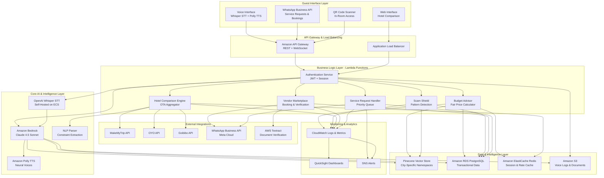
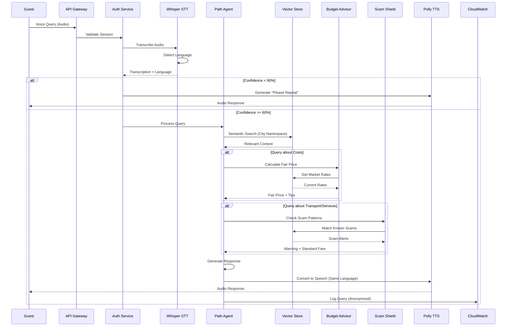
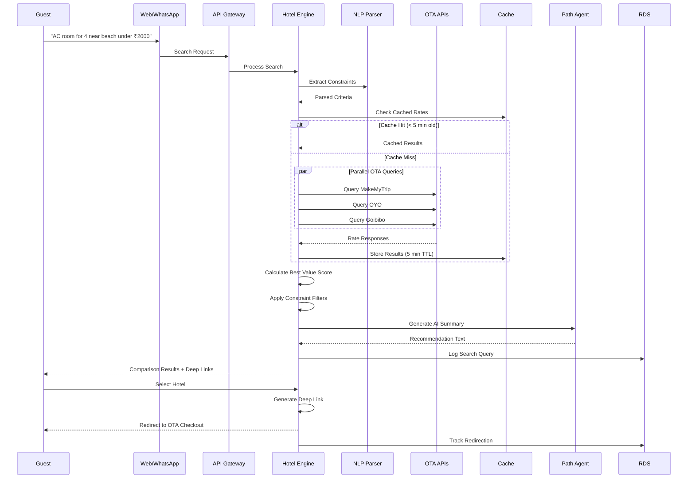
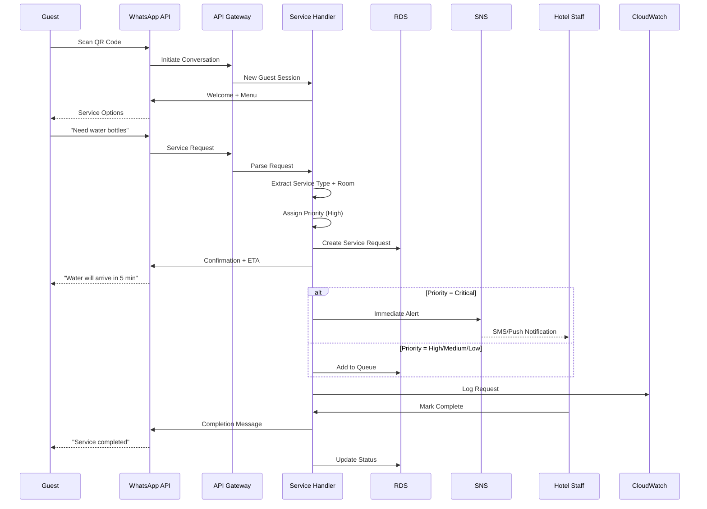
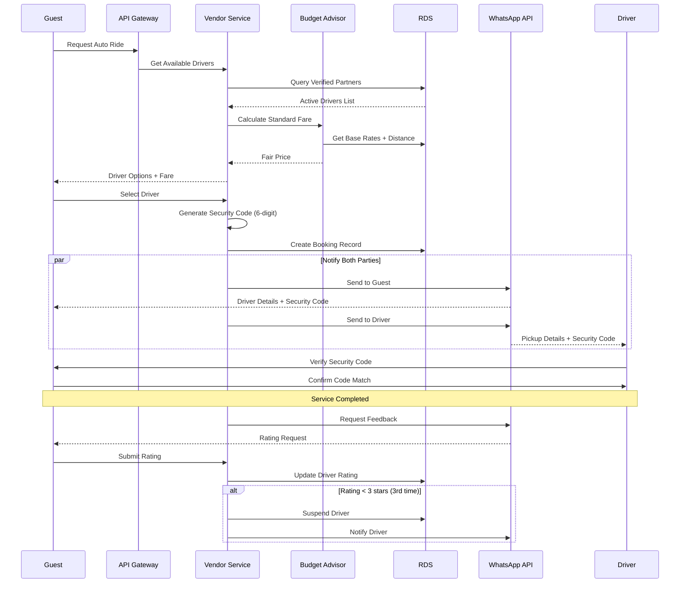

# Design Document: PathAI

## Overview

PathAI is a cloud-native, AI-driven Virtual Concierge platform designed to democratize high-quality hospitality for pilgrims and tourists across India. The system combines voice-first accessibility with real-time "Scam-Shield" intelligence, smart hotel price comparison, and WhatsApp-based in-room services to create a comprehensive travel companion.

The architecture is built on AWS serverless infrastructure with a focus on:
- **Rapid Multi-City Deployment**: Launch in new pilgrimage cities within 24 hours using infrastructure-as-code
- **Voice-First Multilingual Support**: Natural language processing in Odia, Hindi, Bengali, and English
- **Real-Time Intelligence**: Proactive scam warnings and fair-price calculations based on local market data
- **Budget Optimization**: Smart hotel comparison across multiple OTAs with personalized recommendations
- **Trust & Safety**: Verified vendor marketplace with security codes and automated quality monitoring

The platform prioritizes low latency (<2s voice response), high availability (99.9% uptime), data privacy compliance (DPDP Act 2023), and horizontal scalability across multiple cities.

## Architecture

### High-Level System Architecture



### Data Flow Diagrams

#### Voice Query Processing Flow



#### Hotel Comparison Flow



#### WhatsApp Service Request Flow



#### Vendor Booking & Security Code Flow



## Components and Interfaces

### 1. Path Agent (Core AI Engine)

**Technology**: Amazon Bedrock with Claude 4.5 Sonnet

**Responsibilities**:
- Natural language understanding and response generation
- Context-aware conversation management
- Integration with Budget Advisor and Scam Shield
- Multilingual response generation

**Key Interfaces**:
```typescript
interface PathAgentRequest {
  query: string;
  language: 'en' | 'hi' | 'or' | 'bn';
  city: string;
  sessionId: string;
  context?: ConversationContext;
}

interface PathAgentResponse {
  response: string;
  confidence: number;
  detectedIntent: string;
  suggestedActions?: Action[];
  scamAlerts?: ScamAlert[];
  fairPriceEstimate?: PriceEstimate;
}

interface ConversationContext {
  previousQueries: string[];
  userPreferences?: UserPreferences;
  currentLocation?: GeoLocation;
}
```

**Configuration**:
- Model: `anthropic.claude-4.5-sonnet-v2`
- Temperature: 0.7 for conversational responses
- Max tokens: 1024
- System prompt includes city-specific context and scam patterns

### 2. Whisper STT Service

**Technology**: OpenAI Whisper (self-hosted on Amazon ECS Fargate)

**Responsibilities**:
- Audio transcription with language detection
- Quality assessment and confidence scoring
- Support for Odia, Hindi, Bengali, and English

**Key Interfaces**:
```typescript
interface TranscriptionRequest {
  audioData: Buffer;
  format: 'wav' | 'mp3' | 'ogg';
  expectedLanguages?: string[];
}

interface TranscriptionResponse {
  text: string;
  language: string;
  confidence: number;
  duration: number;
  segments?: TranscriptionSegment[];
}

interface TranscriptionSegment {
  text: string;
  start: number;
  end: number;
  confidence: number;
}
```

**Deployment**:
- ECS Fargate tasks with GPU support (g4dn instances)
- Auto-scaling based on queue depth
- Model: `whisper-large-v3` for accuracy
- Average latency: 500-800ms for 10s audio

### 3. Budget Advisor Service

**Technology**: AWS Lambda (Node.js/Python)

**Responsibilities**:
- Fair price calculation based on market rates
- Money-saving tips generation
- Price transparency breakdown
- Standard fare calculation for transport

**Key Interfaces**:
```typescript
interface FairPriceRequest {
  serviceType: 'auto' | 'taxi' | 'tour' | 'hotel';
  city: string;
  distance?: number;
  duration?: number;
  timeOfDay?: string;
  demand?: 'low' | 'medium' | 'high';
}

interface FairPriceResponse {
  fairPrice: number;
  priceRange: { min: number; max: number };
  breakdown: PriceBreakdown;
  moneySavingTips: string[];
  confidence: number;
}

interface PriceBreakdown {
  baseFare: number;
  distanceCharge?: number;
  timeCharge?: number;
  taxes: number;
  fees: number;
  total: number;
}
```

**Data Sources**:
- Vector Store: Historical transaction data
- RDS: Verified Partner pricing history
- Local authority rate cards (updated weekly)

### 4. Scam Shield Service

**Technology**: AWS Lambda (Python with ML libraries)

**Responsibilities**:
- Pattern matching against known scam database
- Proactive alert generation
- Crowd-sourced scam data aggregation
- Real-time vector store updates

**Key Interfaces**:
```typescript
interface ScamCheckRequest {
  query: string;
  city: string;
  serviceType?: string;
  location?: GeoLocation;
}

interface ScamCheckResponse {
  hasScamPattern: boolean;
  alerts: ScamAlert[];
  standardFare?: number;
  safetyTips: string[];
}

interface ScamAlert {
  type: 'overcharging' | 'unofficial_fee' | 'fake_service' | 'unsafe_vendor';
  severity: 'low' | 'medium' | 'high' | 'critical';
  description: string;
  commonPhrases: string[];
  preventionTips: string[];
}
```

**Scam Pattern Database**:
- Stored in Vector Store with embeddings
- Updated every 5 minutes from crowd-sourced reports
- Multilingual pattern matching
- City-specific scam categories

### 5. Hotel Comparison Engine

**Technology**: AWS Lambda (Node.js with async/await)

**Responsibilities**:
- Parallel OTA API aggregation
- Natural language constraint extraction
- Best value calculation
- Deep link generation
- Price transparency display

**Key Interfaces**:
```typescript
interface HotelSearchRequest {
  query: string; // Natural language
  city: string;
  checkIn: string;
  checkOut: string;
  guests: number;
  budget?: number;
}

interface HotelSearchResponse {
  hotels: HotelOption[];
  searchTime: number;
  totalResults: number;
  appliedConstraints: Constraint[];
}

interface HotelOption {
  name: string;
  rating: number;
  price: number;
  priceBreakdown: PriceBreakdown;
  source: 'makemytrip' | 'oyo' | 'goibibo' | 'direct';
  deepLink: string;
  bestValue: boolean;
  aiSummary: string;
  distance: number; // meters from pilgrimage site
  amenities: string[];
  images: string[];
}

interface Constraint {
  type: 'budget' | 'amenity' | 'location' | 'rating' | 'accessibility';
  value: any;
  matched: boolean;
}
```

**OTA Integration**:
- MakeMyTrip: REST API with rate limiting (100 req/min)
- OYO: GraphQL API with caching
- Goibibo: REST API with webhook support
- Fallback: Cached data with freshness timestamp

**Best Value Algorithm**:
```
score = (price_score * 0.5) + (rating_score * 0.3) + (proximity_score * 0.2)

price_score = 1 - (price / max_price)
rating_score = rating / 5.0
proximity_score = 1 - (distance / max_distance)
```

### 6. NLP Parser Service

**Technology**: AWS Lambda (Python with spaCy/transformers)

**Responsibilities**:
- Extract structured constraints from natural language
- Entity recognition (dates, numbers, amenities)
- Intent classification
- Follow-up query handling

**Key Interfaces**:
```typescript
interface NLPParseRequest {
  text: string;
  language: string;
  context?: PreviousConstraints;
}

interface NLPParseResponse {
  constraints: ExtractedConstraint[];
  entities: Entity[];
  intent: string;
  confidence: number;
}

interface ExtractedConstraint {
  field: string;
  operator: 'eq' | 'lt' | 'gt' | 'contains' | 'near';
  value: any;
  confidence: number;
}

interface Entity {
  type: 'date' | 'number' | 'location' | 'amenity' | 'room_type';
  value: string;
  span: [number, number];
}
```

**Supported Constraints**:
- Budget: "under ₹2000", "between 1500 and 2500"
- Amenities: "AC", "WiFi", "parking", "pool"
- Location: "near beach", "walkable to temple", "city center"
- Room type: "deluxe", "suite", "family room"
- Accessibility: "wheelchair accessible", "ground floor"
- Food: "vegetarian food", "Jain food", "breakfast included"

### 7. Vendor Marketplace Service

**Technology**: AWS Lambda (Node.js)

**Responsibilities**:
- Verified Partner management
- Security code generation
- Booking coordination
- Rating and feedback processing
- Automated suspension logic

**Key Interfaces**:
```typescript
interface VendorBookingRequest {
  serviceType: 'auto' | 'taxi' | 'guide';
  city: string;
  pickupLocation: GeoLocation;
  dropLocation?: GeoLocation;
  scheduledTime?: string;
}

interface VendorBookingResponse {
  bookingId: string;
  vendor: VerifiedPartner;
  securityCode: string;
  standardFare: number;
  estimatedArrival: string;
}

interface VerifiedPartner {
  id: string;
  name: string;
  phone: string;
  vehicleNumber?: string;
  rating: number;
  totalTrips: number;
  verificationExpiry: string;
  specializations: string[];
}

interface VendorVerificationRequest {
  governmentId: Document;
  vehicleRegistration?: Document;
  policeClearance: Document;
  businessReferences: Reference[];
}

interface Document {
  type: 'aadhaar' | 'pan' | 'license' | 'registration';
  fileUrl: string;
  expiryDate?: string;
}
```

**Security Code Generation**:
- 6-digit alphanumeric code
- Unique per booking
- Expires after service completion
- Shared via WhatsApp to both parties

**Automated Quality Control**:
```typescript
// Suspension logic
if (consecutiveRatingsBelow3 >= 3 || overchargingReports >= 3) {
  suspendVendor(vendorId);
  notifyVendor(vendorId, suspensionReason);
  notifyHotelManager(vendorId, suspensionReason);
}
```

### 8. Service Request Handler

**Technology**: AWS Lambda (Node.js)

**Responsibilities**:
- WhatsApp message parsing
- Priority assignment
- Queue management
- Staff notification
- Completion tracking

**Key Interfaces**:
```typescript
interface ServiceRequest {
  requestId: string;
  guestId: string;
  roomNumber: string;
  serviceType: 'water' | 'towels' | 'housekeeping' | 'food' | 'maintenance' | 'medical';
  priority: 'critical' | 'high' | 'medium' | 'low';
  description: string;
  timestamp: string;
  estimatedFulfillment: string;
}

interface ServiceRequestResponse {
  requestId: string;
  status: 'queued' | 'in_progress' | 'completed' | 'cancelled';
  estimatedTime: number; // minutes
  assignedStaff?: string;
}
```

**Priority Assignment Logic**:
```typescript
const priorityRules = {
  critical: ['medical', 'safety', 'emergency'],
  high: ['water', 'food', 'ac_not_working'],
  medium: ['towels', 'toiletries', 'housekeeping'],
  low: ['extra_pillows', 'information', 'wifi_password']
};

// Response time SLAs
const slaMinutes = {
  critical: 5,
  high: 15,
  medium: 30,
  low: 60
};
```

### 9. Authentication Service

**Technology**: AWS Lambda (Node.js with JWT)

**Responsibilities**:
- Session management
- JWT token generation and validation
- Rate limiting
- PII anonymization before logging

**Key Interfaces**:
```typescript
interface AuthRequest {
  guestId?: string;
  hotelId: string;
  roomNumber?: string;
  channel: 'voice' | 'whatsapp' | 'web';
}

interface AuthResponse {
  sessionId: string;
  token: string;
  expiresAt: string;
  permissions: string[];
}
```

**Rate Limiting**:
- 100 requests per minute per session
- 1000 requests per hour per hotel
- Implemented using Redis with sliding window

## Data Models

### PostgreSQL Schema (RDS)

```sql
-- Hotels and Properties
CREATE TABLE hotels (
  hotel_id UUID PRIMARY KEY,
  name VARCHAR(255) NOT NULL,
  city VARCHAR(100) NOT NULL,
  address TEXT,
  coordinates GEOGRAPHY(POINT),
  contact_phone VARCHAR(20),
  created_at TIMESTAMP DEFAULT NOW()
);

-- Guests (minimal PII, encrypted)
CREATE TABLE guests (
  guest_id UUID PRIMARY KEY,
  hotel_id UUID REFERENCES hotels(hotel_id),
  room_number VARCHAR(10),
  check_in_date DATE,
  check_out_date DATE,
  language_preference VARCHAR(5),
  created_at TIMESTAMP DEFAULT NOW(),
  anonymized_at TIMESTAMP -- Set when guest checks out
);

-- Service Requests
CREATE TABLE service_requests (
  request_id UUID PRIMARY KEY,
  guest_id UUID REFERENCES guests(guest_id),
  hotel_id UUID REFERENCES hotels(hotel_id),
  service_type VARCHAR(50) NOT NULL,
  priority VARCHAR(20) NOT NULL,
  description TEXT,
  status VARCHAR(20) DEFAULT 'queued',
  created_at TIMESTAMP DEFAULT NOW(),
  completed_at TIMESTAMP,
  assigned_staff VARCHAR(100),
  INDEX idx_status_priority (status, priority, created_at)
);

-- Verified Partners
CREATE TABLE verified_partners (
  partner_id UUID PRIMARY KEY,
  name VARCHAR(255) NOT NULL,
  phone VARCHAR(20) NOT NULL,
  city VARCHAR(100) NOT NULL,
  service_type VARCHAR(50) NOT NULL,
  vehicle_number VARCHAR(20),
  rating DECIMAL(3,2) DEFAULT 5.00,
  total_trips INTEGER DEFAULT 0,
  verification_status VARCHAR(20) DEFAULT 'pending',
  verification_expiry DATE,
  suspended BOOLEAN DEFAULT FALSE,
  created_at TIMESTAMP DEFAULT NOW(),
  INDEX idx_city_service (city, service_type, verification_status)
);

-- Vendor Bookings
CREATE TABLE vendor_bookings (
  booking_id UUID PRIMARY KEY,
  guest_id UUID REFERENCES guests(guest_id),
  partner_id UUID REFERENCES verified_partners(partner_id),
  security_code VARCHAR(10) NOT NULL,
  service_type VARCHAR(50) NOT NULL,
  pickup_location GEOGRAPHY(POINT),
  drop_location GEOGRAPHY(POINT),
  standard_fare DECIMAL(10,2),
  actual_fare DECIMAL(10,2),
  status VARCHAR(20) DEFAULT 'pending',
  rating INTEGER,
  feedback TEXT,
  created_at TIMESTAMP DEFAULT NOW(),
  completed_at TIMESTAMP,
  INDEX idx_partner_status (partner_id, status),
  INDEX idx_security_code (security_code)
);

-- Fair Price Database
CREATE TABLE fair_prices (
  price_id UUID PRIMARY KEY,
  city VARCHAR(100) NOT NULL,
  service_type VARCHAR(50) NOT NULL,
  base_fare DECIMAL(10,2) NOT NULL,
  per_km_rate DECIMAL(10,2),
  per_minute_rate DECIMAL(10,2),
  surge_multiplier DECIMAL(3,2) DEFAULT 1.0,
  valid_from TIMESTAMP NOT NULL,
  valid_until TIMESTAMP,
  source VARCHAR(100), -- 'authority' | 'crowd_sourced' | 'verified_partner'
  INDEX idx_city_service_valid (city, service_type, valid_from, valid_until)
);

-- Scam Reports (Crowd-Sourced)
CREATE TABLE scam_reports (
  report_id UUID PRIMARY KEY,
  city VARCHAR(100) NOT NULL,
  scam_type VARCHAR(50) NOT NULL,
  description TEXT NOT NULL,
  common_phrases TEXT[], -- Array of phrases
  severity VARCHAR(20) NOT NULL,
  verified BOOLEAN DEFAULT FALSE,
  report_count INTEGER DEFAULT 1,
  last_reported TIMESTAMP DEFAULT NOW(),
  created_at TIMESTAMP DEFAULT NOW(),
  INDEX idx_city_verified (city, verified)
);

-- Hotel Search Logs
CREATE TABLE hotel_searches (
  search_id UUID PRIMARY KEY,
  guest_id UUID REFERENCES guests(guest_id),
  city VARCHAR(100) NOT NULL,
  query_text TEXT,
  extracted_constraints JSONB,
  results_count INTEGER,
  selected_hotel VARCHAR(255),
  selected_ota VARCHAR(50),
  booking_completed BOOLEAN DEFAULT FALSE,
  created_at TIMESTAMP DEFAULT NOW(),
  INDEX idx_city_date (city, created_at)
);

-- Analytics: Query Logs (Anonymized)
CREATE TABLE query_logs (
  log_id UUID PRIMARY KEY,
  city VARCHAR(100) NOT NULL,
  language VARCHAR(5) NOT NULL,
  query_type VARCHAR(50), -- 'cost' | 'scam_check' | 'hotel_search' | 'service_request'
  intent VARCHAR(100),
  response_time_ms INTEGER,
  confidence DECIMAL(3,2),
  created_at TIMESTAMP DEFAULT NOW(),
  INDEX idx_city_date_type (city, created_at, query_type)
);
```

### Vector Store Schema (Pinecone)

**Namespace Structure**:
```
{city_name}:scam_alerts
{city_name}:fair_prices
{city_name}:local_knowledge
{city_name}:hotel_reviews
```

**Vector Metadata**:
```typescript
interface VectorMetadata {
  city: string;
  category: 'scam' | 'price' | 'knowledge' | 'review';
  language: string;
  lastUpdated: string;
  source: string;
  verified: boolean;
}
```

**Example Scam Alert Vector**:
```json
{
  "id": "puri_scam_001",
  "values": [0.123, -0.456, ...], // 1536-dim embedding
  "metadata": {
    "city": "puri",
    "category": "scam",
    "scam_type": "unofficial_darshan_fee",
    "severity": "high",
    "description": "Fake VIP darshan tickets sold outside temple",
    "common_phrases": ["special darshan", "VIP entry", "government approved"],
    "language": "en",
    "verified": true,
    "lastUpdated": "2024-01-15T10:30:00Z"
  }
}
```

### Redis Cache Schema (ElastiCache)

**Key Patterns**:
```
session:{sessionId} -> SessionData (TTL: 1 hour)
rate_limit:{sessionId}:{minute} -> RequestCount (TTL: 2 minutes)
hotel_rates:{city}:{checkIn}:{checkOut} -> OTARates (TTL: 5 minutes)
fair_price:{city}:{serviceType} -> PriceData (TTL: 1 hour)
scam_alerts:{city} -> ScamAlerts (TTL: 5 minutes)
```

## Correctness Properties

*A property is a characteristic or behavior that should hold true across all valid executions of a system—essentially, a formal statement about what the system should do. Properties serve as the bridge between human-readable specifications and machine-verifiable correctness guarantees.*


### Property Reflection

After analyzing all acceptance criteria, I've identified the following consolidations to eliminate redundancy:

**Consolidations**:
- Properties 3.5 and 3.6 (service request confirmations) can be combined into a single property about request lifecycle notifications
- Properties 4.2 and 4.4 (fare display completeness) overlap and can be consolidated
- Properties 11.5 and 7.4 (price transparency) address the same concern and can be unified
- Properties 1.7, 6.6, and 8.4 (logging requirements) can be consolidated into a general logging property
- Properties 5.4 and 5.5 (data security) can be combined into a comprehensive data protection property

**Unique Properties Retained**:
- Language detection accuracy (1.2) - specific threshold requirement
- Response language matching (1.5) - critical for multilingual support
- Scam pattern detection (2.1, 2.2) - core safety feature
- Security code uniqueness (4.3) - critical for vendor verification
- Automated suspension logic (4.7) - important quality control
- OTA aggregation (11.1) - core hotel comparison feature
- NLP constraint extraction (12.1, 12.2) - essential for natural language search
- Deep link parameter preservation (13.2, 13.3) - ensures booking consistency

### Correctness Properties

Property 1: Voice transcription language detection accuracy
*For any* voice query in Odia, Hindi, Bengali, or English, the Whisper_STT service should detect the correct language with at least 95% confidence
**Validates: Requirements 1.2**

Property 2: Response language consistency
*For any* voice query, the response generated by Polly_TTS should be in the same language as the input query detected by Whisper_STT
**Validates: Requirements 1.5**

Property 3: Fair price inclusion in cost queries
*For any* valid query about travel costs or services, the Budget_Advisor response should include a Fair_Price estimate retrieved from the Vector_Store
**Validates: Requirements 1.3**

Property 4: Money-saving tips in budget responses
*For any* cost-related query response, the Budget_Advisor should include at least one actionable money-saving tip
**Validates: Requirements 1.4**

Property 5: Scam pattern detection for risky queries
*For any* query about local transport, "Special Darshan," or paid services, the Scam_Shield should check the Vector_Store for known scam patterns and provide alerts if matches are found
**Validates: Requirements 2.1, 2.2**

Property 6: Vector store update propagation timing
*For any* Scam_Alert data update from authorized sources, the Vector_Store embeddings should be refreshed within 5 minutes
**Validates: Requirements 2.4**

Property 7: Standard fare calculation completeness
*For any* location pair (pickup and destination), the Budget_Advisor should calculate a Standard_Fare and provide a breakdown showing base fare, distance charge, and applicable fees
**Validates: Requirements 2.5, 2.6**

Property 8: Service request parsing completeness
*For any* Service_Request received via WhatsApp, the parser should successfully extract both the service type and room number
**Validates: Requirements 3.2**

Property 9: Service request priority assignment
*For any* validated Service_Request, the system should assign a priority level (critical, high, medium, or low) based on the predefined urgency categories
**Validates: Requirements 3.3**

Property 10: Service request lifecycle notifications
*For any* Service_Request, the system should send confirmation messages at both queuing time (with ETA) and completion time
**Validates: Requirements 3.5, 3.6**

Property 11: Verified partner filtering
*For any* guest request for local services, all displayed partner options should have verified status (verified = true in the database)
**Validates: Requirements 4.1**

Property 12: Booking information completeness
*For any* confirmed vendor booking, the guest should receive all required information: driver name, vehicle number, Security_Code, and Standard_Fare
**Validates: Requirements 4.2, 4.4**

Property 13: Security code uniqueness
*For any* two concurrent vendor bookings, the generated Security_Codes should be unique (no collisions)
**Validates: Requirements 4.3**

Property 14: Feedback request timing
*For any* completed service, the system should send a feedback request to the guest within 1 hour of completion
**Validates: Requirements 4.5**

Property 15: Overcharging detection and flagging
*For any* vendor booking where the actual_fare exceeds the quoted Standard_Fare, the system should automatically flag the partner for review
**Validates: Requirements 4.6**

Property 16: Automated partner suspension
*For any* Verified_Partner who receives either 3 reports of overcharging OR 3 consecutive ratings below 3 stars, the system should automatically suspend their Verified_Partner status
**Validates: Requirements 4.7**

Property 17: Dispute logging and reference generation
*For any* guest-reported pricing dispute, the system should create a log entry and provide the guest with a unique complaint reference number
**Validates: Requirements 4.8**

Property 18: Data anonymization before storage
*For any* guest voice log or interaction data stored in S3, all personally identifiable information (PII) should be anonymized before storage
**Validates: Requirements 5.4**

Property 19: Data encryption in transit and at rest
*For any* guest interaction data, the system should encrypt it using TLS 1.3 during transmission and S3 server-side encryption at rest
**Validates: Requirements 5.5**

Property 20: Data deletion timing compliance
*For any* guest checkout or data deletion request, all voice recordings and personal information should be removed from storage within 24 hours
**Validates: Requirements 5.6**

Property 21: Vendor application document requirements
*For any* vendor application for Verified_Partner status, the system should reject applications missing any required documents: government ID, vehicle registration (for drivers), police clearance, or business references
**Validates: Requirements 6.1**

Property 22: Verification badge validity period
*For any* approved vendor, the assigned Verified_Partner badge should have an expiry date exactly 12 months from the approval date
**Validates: Requirements 6.4**

Property 23: Expired partner booking prevention
*For any* Verified_Partner whose badge has expired, the system should prevent them from receiving new bookings until re-verification is completed
**Validates: Requirements 6.5**

Property 24: Comprehensive activity logging
*For any* verification activity, service request, error, or critical system event, the system should create a log entry with timestamp and relevant context in CloudWatch
**Validates: Requirements 6.6, 1.7, 8.4**

Property 25: Fair price calculation factor inclusion
*For any* Fair_Price calculation, the Budget_Advisor should consider all required factors: base rate, distance, time of day, and current demand
**Validates: Requirements 7.2**

Property 26: Price transparency display completeness
*For any* displayed hotel option or service fare, the system should provide a complete breakdown showing base fare, taxes, service charges, and any hidden fees, plus the total price
**Validates: Requirements 7.4, 11.5**

Property 27: Price deviation flagging threshold
*For any* transaction where the actual price deviates more than 30% from the Fair_Price, the system should automatically flag the transaction for review
**Validates: Requirements 7.6**

Property 28: Fallback mode alerting
*For any* activation of fallback mode (due to component failure), the system should send an alert to hotel staff
**Validates: Requirements 8.6**

Property 29: WhatsApp message routing
*For any* guest message sent to the PathAI WhatsApp number, the system should route it to the appropriate handler (service request, price inquiry, or scam check) based on message content analysis
**Validates: Requirements 9.1**

Property 30: Initial response timing
*For any* guest-initiated WhatsApp contact, the system should respond within 30 seconds with a greeting and menu options
**Validates: Requirements 9.3**

Property 31: Conversation context preservation during handoff
*For any* conversation that requires human intervention, the system should transfer to a staff member with the complete conversation history preserved
**Validates: Requirements 9.5**

Property 32: Conversation history retention period
*For any* WhatsApp conversation, the system should maintain the conversation history for exactly 30 days for quality assurance and dispute resolution
**Validates: Requirements 9.6**

Property 33: Multi-OTA aggregation requirement
*For any* hotel search within a specific budget, the system should aggregate and compare real-time rates from at least three major OTAs (MakeMyTrip, OYO, Goibibo)
**Validates: Requirements 11.1**

Property 34: Hotel search response time
*For any* hotel comparison request, the system should complete the OTA aggregation and return results within 10 seconds
**Validates: Requirements 11.2**

Property 35: Best value calculation algorithm
*For any* hotel with multiple rate options, the system should calculate the Best_Value score using the weighted algorithm: price (50%), ratings (30%), proximity (20%)
**Validates: Requirements 11.3**

Property 36: Direct booking prioritization
*For any* hotel where a direct booking rate is lower than all OTA rates, the system should prioritize and highlight the direct booking link
**Validates: Requirements 11.4**

Property 37: NLP constraint extraction from natural language
*For any* natural language hotel search query, the Path_Agent should extract structured constraints including budget limit, room type, amenities, guest count, and location preferences
**Validates: Requirements 12.1**

Property 38: Constraint-based hotel filtering
*For any* set of user-specified constraints, the system should apply all constraints when filtering hotel results (no constraint should be ignored)
**Validates: Requirements 12.2**

Property 39: AI recommendation summary generation
*For any* hotel that matches the budget and constraints, the Path_Agent should generate a brief AI summary (max 2 sentences) explaining why it's recommended
**Validates: Requirements 12.3**

Property 40: Comparative insights in recommendations
*For any* hotel recommendation, the system should include at least one comparative insight (e.g., distance comparison, rating comparison, price comparison)
**Validates: Requirements 12.4**

Property 41: Relevance-based result ranking
*For any* hotel search results, the system should rank results using the relevance score formula: constraint matching (40%), price competitiveness (30%), ratings (20%), availability (10%)
**Validates: Requirements 12.5**

Property 42: Insufficient budget alternative suggestions
*For any* hotel search where the guest's budget is insufficient for available options, the system should suggest the closest alternatives with a message indicating the price difference
**Validates: Requirements 12.6**

Property 43: Search context preservation for refinements
*For any* follow-up refinement query (e.g., "show me only options with parking"), the system should preserve the previous search context without requiring the guest to restart
**Validates: Requirements 12.7**

Property 44: Deep link generation for hotel selections
*For any* guest selection of a hotel from the comparison list, the system should generate a Deep_Link that redirects to the specific checkout page of the chosen OTA or hotel website
**Validates: Requirements 13.1**

Property 45: Deep link parameter preservation
*For any* generated Deep_Link, all search parameters should be maintained: check-in date, check-out date, guest count, room type, and special requests
**Validates: Requirements 13.2**

Property 46: OTA redirect consistency
*For any* redirection to an OTA, the pre-selected room type and rate in the OTA checkout should exactly match what was displayed in the PathAI comparison
**Validates: Requirements 13.3**

Property 47: Redirection tracking for analytics
*For any* successful redirection to an OTA or hotel website, the system should log the redirection event with booking tracking information for analytics
**Validates: Requirements 13.6**

## Error Handling

### Error Categories and Strategies

**1. External Service Failures**

**Bedrock (Path Agent) Unavailable**:
- Fallback: Pre-configured template responses for common queries
- Cache: Last 100 most frequent Q&A pairs per city
- User notification: "AI assistant temporarily unavailable, using quick responses"
- Automatic retry: Exponential backoff (1s, 2s, 4s, 8s)
- Alert: SNS notification to operations team

**Whisper STT Failures**:
- Low confidence (<60%): Request user to repeat query
- Service unavailable: Offer text-based input via WhatsApp
- Timeout (>5s): Cancel and prompt for text input
- Audio format errors: Return supported format list

**OTA API Failures**:
- Individual OTA timeout: Continue with available OTAs
- All OTAs unavailable: Serve cached rates with timestamp
- Rate limiting: Implement exponential backoff and queue requests
- Cache TTL: 5 minutes for rates, 1 hour for hotel metadata

**WhatsApp API Failures**:
- Message delivery failure: Retry 3 times with exponential backoff
- Webhook timeout: Queue message for async processing
- Media upload failure: Fall back to text-only message
- Template rejection: Use fallback generic template

**2. Data Layer Failures**

**Vector Store (Pinecone) Unavailable**:
- Fallback: Serve cached scam alerts and fair prices from Redis
- Cache refresh: Every 5 minutes when Vector Store is healthy
- Degraded mode: Disable semantic search, use keyword matching
- Alert: CloudWatch alarm triggers SNS notification

**RDS Connection Failures**:
- Connection pool exhaustion: Queue requests with timeout
- Read replica failure: Failover to primary instance
- Primary failure: Promote read replica (automatic RDS Multi-AZ)
- Transaction timeout: Rollback and return error to user

**Redis Cache Failures**:
- Cache miss: Query primary data source (RDS/Vector Store)
- Connection timeout: Skip cache, query directly
- Eviction: Repopulate from database on next request
- Cluster failure: Operate without cache (degraded performance)

**3. Business Logic Errors**

**Invalid Service Requests**:
- Missing room number: Request clarification via WhatsApp
- Unrecognized service type: Offer menu of valid options
- Duplicate request: Check if previous request is still pending
- After-hours request: Queue for next business day with notification

**Vendor Booking Errors**:
- No available partners: Suggest alternative service types or times
- Security code collision: Regenerate new code (max 3 attempts)
- Fare calculation failure: Use fallback base rates from config
- Partner suspension during booking: Cancel and offer alternatives

**Hotel Search Errors**:
- No results matching constraints: Relax constraints incrementally
- NLP parsing failure: Fall back to structured form input
- Deep link generation failure: Provide manual search parameters
- Budget too low: Show closest options with price difference

**4. Data Validation Errors**

**Input Validation**:
```typescript
// Example validation error handling
interface ValidationError {
  field: string;
  message: string;
  suggestedFix?: string;
}

function validateServiceRequest(request: ServiceRequest): ValidationError[] {
  const errors: ValidationError[] = [];
  
  if (!request.roomNumber || !/^\d{3,4}$/.test(request.roomNumber)) {
    errors.push({
      field: 'roomNumber',
      message: 'Invalid room number format',
      suggestedFix: 'Please provide a 3-4 digit room number'
    });
  }
  
  if (!VALID_SERVICE_TYPES.includes(request.serviceType)) {
    errors.push({
      field: 'serviceType',
      message: 'Unrecognized service type',
      suggestedFix: `Valid options: ${VALID_SERVICE_TYPES.join(', ')}`
    });
  }
  
  return errors;
}
```

**5. Security and Rate Limiting**

**Rate Limit Exceeded**:
- Per session: 100 requests/minute
- Per hotel: 1000 requests/hour
- Response: HTTP 429 with Retry-After header
- User message: "Too many requests, please wait {seconds} seconds"

**Authentication Failures**:
- Invalid JWT: Return 401, prompt re-authentication
- Expired session: Refresh token if refresh token valid
- Missing credentials: Return 403 with authentication instructions

**Suspicious Activity**:
- Multiple failed auth attempts: Temporary IP block (15 minutes)
- Unusual request patterns: Flag for manual review
- SQL injection attempts: Block and log to security team

**6. Monitoring and Alerting**

**CloudWatch Alarms**:
- Error rate > 5%: Warning alert
- Error rate > 10%: Critical alert with PagerDuty
- Response time > 5s (p95): Performance degradation alert
- Fallback mode activated: Immediate notification

**Error Logging Format**:
```typescript
interface ErrorLog {
  timestamp: string;
  errorType: string;
  severity: 'low' | 'medium' | 'high' | 'critical';
  component: string;
  message: string;
  stackTrace?: string;
  context: {
    sessionId?: string;
    city?: string;
    requestId: string;
    userId?: string; // anonymized
  };
  resolution?: string;
}
```

**Automatic Recovery**:
- Health checks every 30 seconds
- Auto-restart unhealthy ECS tasks
- Lambda automatic retries (2 attempts)
- Circuit breaker pattern for external APIs (open after 5 failures)

## Testing Strategy

### Dual Testing Approach

PathAI requires both unit testing and property-based testing to ensure comprehensive coverage. Unit tests validate specific examples and edge cases, while property tests verify universal correctness properties across all inputs.

**Unit Testing Focus**:
- Specific examples demonstrating correct behavior
- Integration points between components
- Edge cases and error conditions
- API contract validation
- Mock external service responses

**Property-Based Testing Focus**:
- Universal properties that hold for all inputs
- Comprehensive input coverage through randomization
- Invariant validation across operations
- Round-trip properties for serialization/parsing
- Minimum 100 iterations per property test

### Property-Based Testing Configuration

**Library Selection**:
- **JavaScript/TypeScript**: fast-check
- **Python**: Hypothesis

**Test Configuration**:
```typescript
// Example fast-check configuration
import fc from 'fast-check';

describe('PathAI Property Tests', () => {
  it('Property 2: Response language consistency', () => {
    fc.assert(
      fc.property(
        fc.record({
          audioData: fc.uint8Array({ minLength: 1000, maxLength: 10000 }),
          language: fc.constantFrom('en', 'hi', 'or', 'bn')
        }),
        async (input) => {
          const transcription = await whisperSTT.transcribe(input.audioData);
          const response = await pathAgent.process(transcription.text, transcription.language);
          const audioResponse = await pollyTTS.synthesize(response.text, transcription.language);
          
          // Property: Output language should match input language
          expect(audioResponse.language).toBe(transcription.language);
        }
      ),
      { numRuns: 100 } // Minimum 100 iterations
    );
  });
  
  // Tag format for traceability
  // Feature: puripath-ai, Property 2: Response language consistency
});
```

**Property Test Tags**:
Each property test must include a comment tag referencing the design document property:
```
// Feature: puripath-ai, Property {number}: {property_text}
```

### Test Coverage by Component

**1. Path Agent (Bedrock Integration)**

Unit Tests:
- Specific query examples for each intent type
- Context preservation across conversation turns
- Error handling for malformed queries
- Timeout handling

Property Tests:
- Property 2: Response language consistency
- Property 3: Fair price inclusion in cost queries
- Property 4: Money-saving tips in budget responses
- Property 37: NLP constraint extraction
- Property 39: AI recommendation summary generation

**2. Whisper STT Service**

Unit Tests:
- Supported audio formats (wav, mp3, ogg)
- Low-quality audio handling
- Silent audio detection
- Multi-speaker audio

Property Tests:
- Property 1: Language detection accuracy (95% threshold)
- Edge case: Audio confidence below 60%

**3. Budget Advisor Service**

Unit Tests:
- Base fare calculation examples
- Surge pricing scenarios
- Time-of-day variations
- Distance-based pricing

Property Tests:
- Property 3: Fair price inclusion
- Property 7: Standard fare calculation completeness
- Property 25: Fair price calculation factor inclusion
- Property 26: Price transparency display

**4. Scam Shield Service**

Unit Tests:
- Known scam phrase detection
- Multi-language scam patterns
- Severity level assignment
- False positive scenarios

Property Tests:
- Property 5: Scam pattern detection for risky queries
- Property 6: Vector store update propagation timing

**5. Hotel Comparison Engine**

Unit Tests:
- Single OTA response handling
- OTA timeout scenarios
- Cache hit/miss behavior
- Deep link generation examples

Property Tests:
- Property 33: Multi-OTA aggregation requirement
- Property 34: Hotel search response time
- Property 35: Best value calculation algorithm
- Property 36: Direct booking prioritization
- Property 38: Constraint-based filtering
- Property 41: Relevance-based ranking
- Property 44: Deep link generation
- Property 45: Deep link parameter preservation
- Property 46: OTA redirect consistency

**6. NLP Parser Service**

Unit Tests:
- Specific constraint extraction examples
- Entity recognition accuracy
- Multi-constraint queries
- Ambiguous query handling

Property Tests:
- Property 37: NLP constraint extraction
- Property 43: Search context preservation

**7. Vendor Marketplace Service**

Unit Tests:
- Security code format validation
- Booking confirmation flow
- Rating submission
- Suspension trigger examples

Property Tests:
- Property 11: Verified partner filtering
- Property 12: Booking information completeness
- Property 13: Security code uniqueness
- Property 14: Feedback request timing
- Property 15: Overcharging detection
- Property 16: Automated partner suspension
- Property 22: Verification badge validity
- Property 23: Expired partner booking prevention

**8. Service Request Handler**

Unit Tests:
- Priority assignment examples
- Queue ordering
- Staff notification triggers
- Completion workflow

Property Tests:
- Property 8: Service request parsing
- Property 9: Priority assignment
- Property 10: Lifecycle notifications

**9. WhatsApp Integration**

Unit Tests:
- Message template formatting
- Rich media handling
- Quick reply button generation
- Conversation handoff

Property Tests:
- Property 29: Message routing
- Property 30: Initial response timing
- Property 31: Context preservation during handoff
- Property 32: Conversation history retention

**10. Data Security & Privacy**

Unit Tests:
- PII detection examples
- Encryption verification
- Data deletion workflow
- Audit log format

Property Tests:
- Property 18: Data anonymization
- Property 19: Data encryption
- Property 20: Data deletion timing
- Property 24: Comprehensive activity logging

### Integration Testing

**End-to-End Flows**:
1. Voice query → Transcription → AI response → TTS → Audio output
2. Hotel search → OTA aggregation → Best value calculation → Deep link generation
3. Service request → Priority assignment → Staff notification → Completion
4. Vendor booking → Security code generation → WhatsApp notification → Feedback

**External Service Mocking**:
- Mock Bedrock responses for consistent testing
- Mock OTA APIs with realistic rate data
- Mock WhatsApp API for message delivery
- Mock Textract for document verification

**Performance Testing**:
- Load testing: 1000 concurrent users per city
- Stress testing: OTA API failures under load
- Latency testing: Voice response time <2s
- Scalability testing: Multi-city deployment

### Continuous Integration

**CI/CD Pipeline**:
1. Unit tests run on every commit
2. Property tests run on every PR
3. Integration tests run on merge to main
4. Performance tests run nightly
5. Security scans run weekly

**Test Coverage Requirements**:
- Unit test coverage: >80%
- Property test coverage: All correctness properties
- Integration test coverage: All critical user flows
- E2E test coverage: Top 10 user journeys

**Deployment Gates**:
- All tests must pass
- No critical security vulnerabilities
- Performance benchmarks met
- Code review approved


## Technology Stack

### Core Infrastructure (AWS)

**Compute**:
- **AWS Lambda**: Serverless functions for all business logic services
  - Runtime: Node.js 20.x for API services, Python 3.11 for ML services
  - Memory: 512MB-3GB based on service requirements
  - Timeout: 30s for API calls, 5 minutes for batch operations
  - Concurrency: Reserved capacity per city (100 concurrent executions)

- **Amazon ECS Fargate**: Container orchestration for Whisper STT
  - Instance type: g4dn.xlarge (GPU-enabled for ML inference)
  - Auto-scaling: Target CPU utilization 70%
  - Task definition: 4 vCPU, 16GB RAM per task
  - Minimum tasks: 2 per city for high availability

**API & Networking**:
- **Amazon API Gateway**: REST and WebSocket APIs
  - REST API: Regional endpoint with custom domain
  - WebSocket API: For real-time voice streaming
  - Throttling: 10,000 requests/second per city
  - Caching: 5-minute TTL for GET endpoints

- **Application Load Balancer**: For web interface and ECS services
  - Health checks: Every 30 seconds
  - Connection draining: 300 seconds
  - SSL/TLS: ACM certificates with automatic renewal

**AI & ML Services**:
- **Amazon Bedrock**: Claude 4.5 Sonnet for Path Agent
  - Model ID: `anthropic.claude-4.5-sonnet-v2`
  - Provisioned throughput: 1000 tokens/second per city
  - Context window: 200K tokens
  - Streaming: Enabled for real-time responses

- **Amazon Polly**: Neural TTS for voice output
  - Voices: Aditi (Hindi), Raveena (English), custom voices for Odia/Bengali
  - Format: MP3, 24kHz sample rate
  - SSML support: For natural prosody

- **AWS Textract**: Document verification for vendor onboarding
  - Features: Text extraction, form data extraction, ID validation
  - Async processing: For large documents

**Data Storage**:
- **Amazon RDS PostgreSQL**: Transactional data
  - Version: PostgreSQL 15.x
  - Instance: db.r6g.xlarge (4 vCPU, 32GB RAM)
  - Multi-AZ: Enabled for high availability
  - Read replicas: 2 per region for read scaling
  - Backup: Automated daily snapshots, 7-day retention
  - Encryption: At-rest with KMS, in-transit with SSL

- **Amazon S3**: Object storage for voice logs and documents
  - Storage class: S3 Standard for active data, S3 Glacier for archives
  - Versioning: Enabled for audit compliance
  - Lifecycle policies: Move to Glacier after 30 days, delete after 90 days
  - Encryption: SSE-S3 for voice logs, SSE-KMS for sensitive documents

- **Amazon ElastiCache Redis**: Session and rate cache
  - Version: Redis 7.x
  - Node type: cache.r6g.large (2 vCPU, 13GB RAM)
  - Cluster mode: Enabled with 3 shards
  - Replication: 2 replicas per shard
  - Backup: Daily snapshots, 7-day retention

**Vector Database**:
- **Pinecone**: Managed vector database for semantic search
  - Index type: Serverless (auto-scaling)
  - Dimensions: 1536 (OpenAI ada-002 embeddings)
  - Metric: Cosine similarity
  - Namespaces: One per city for data isolation
  - Replication: Multi-region for disaster recovery

**Monitoring & Observability**:
- **Amazon CloudWatch**: Logs, metrics, and alarms
  - Log retention: 30 days for application logs, 90 days for audit logs
  - Custom metrics: Response time, error rate, cache hit rate
  - Dashboards: Real-time operational dashboards per city
  - Alarms: SNS notifications for critical issues

- **AWS X-Ray**: Distributed tracing
  - Sampling rate: 10% for normal traffic, 100% for errors
  - Trace retention: 30 days
  - Service map: Visualize dependencies and bottlenecks

- **Amazon QuickSight**: Business intelligence dashboards
  - Data sources: RDS, S3, CloudWatch
  - Refresh schedule: Hourly for operational metrics, daily for analytics
  - Sharing: Role-based access for hotel managers and operations team

**Security & Compliance**:
- **AWS IAM**: Identity and access management
  - Principle of least privilege
  - Service roles for Lambda, ECS, RDS
  - Cross-account roles for multi-city deployments

- **AWS KMS**: Key management for encryption
  - Customer-managed keys for sensitive data
  - Automatic key rotation: Enabled
  - Key policies: Restrict access to specific services

- **AWS WAF**: Web application firewall
  - Managed rules: OWASP Top 10, known bad inputs
  - Rate limiting: 2000 requests per 5 minutes per IP
  - Geo-blocking: Optional per deployment

- **AWS Secrets Manager**: Secure credential storage
  - Rotation: Automatic rotation every 90 days
  - Encryption: KMS-encrypted at rest
  - Access: IAM-based with audit logging

**Infrastructure as Code**:
- **AWS CloudFormation**: Primary IaC tool
  - Nested stacks: Separate stacks for networking, compute, data
  - Change sets: Preview changes before deployment
  - Stack policies: Prevent accidental deletion of critical resources

- **Terraform** (Alternative): For multi-cloud scenarios
  - State backend: S3 with DynamoDB locking
  - Modules: Reusable modules for city deployments
  - Workspaces: One per city/environment

### External Services

**WhatsApp Business API**:
- **Provider**: Meta Cloud API
- **Features**: Message templates, rich media, quick replies, webhooks
- **Rate limits**: 1000 messages/second per phone number
- **Pricing**: Conversation-based pricing (varies by country)

**OTA Integrations**:
- **MakeMyTrip API**:
  - Protocol: REST with OAuth 2.0
  - Rate limit: 100 requests/minute
  - Response time: ~2-3 seconds average
  - Caching: 5-minute TTL for rate data

- **OYO API**:
  - Protocol: GraphQL
  - Rate limit: 200 requests/minute
  - Response time: ~1-2 seconds average
  - Webhooks: Real-time rate updates

- **Goibibo API**:
  - Protocol: REST with API key
  - Rate limit: 150 requests/minute
  - Response time: ~2-3 seconds average
  - Batch queries: Support for multi-hotel queries

**OpenAI Whisper**:
- **Deployment**: Self-hosted on ECS Fargate
- **Model**: whisper-large-v3
- **Hardware**: NVIDIA T4 GPU (g4dn instances)
- **Optimization**: TensorRT for inference acceleration
- **Fallback**: AWS Transcribe for high-load scenarios

### Development Tools

**Version Control**:
- **Git**: Source code management
- **GitHub**: Repository hosting with branch protection
- **GitHub Actions**: CI/CD pipelines

**Testing Frameworks**:
- **Jest**: JavaScript/TypeScript unit testing
- **fast-check**: Property-based testing for TypeScript
- **Pytest**: Python unit testing
- **Hypothesis**: Property-based testing for Python
- **Supertest**: API integration testing
- **Playwright**: E2E testing for web interface

**Code Quality**:
- **ESLint**: JavaScript/TypeScript linting
- **Prettier**: Code formatting
- **Black**: Python code formatting
- **SonarQube**: Code quality and security analysis
- **Dependabot**: Automated dependency updates

**Local Development**:
- **Docker Compose**: Local service orchestration
- **LocalStack**: AWS service emulation
- **Pinecone local**: Vector database emulation
- **ngrok**: Webhook testing for WhatsApp

## Scalability Considerations

### Multi-City Deployment Architecture

**City-Agnostic Design Principles**:

1. **Data Isolation**: Each city has isolated data stores
   - Vector Store: Separate namespaces per city
   - RDS: Separate schemas per city (or separate databases for large cities)
   - Redis: Separate key prefixes per city
   - S3: Separate bucket prefixes per city

2. **Configuration-Driven**: City-specific settings in configuration
   ```typescript
   interface CityConfig {
     cityId: string;
     cityName: string;
     languages: string[]; // ['en', 'hi', 'or', 'bn']
     baseFares: {
       auto: number;
       taxi: number;
       guide: number;
     };
     scamAlerts: ScamAlert[];
     otaProviders: string[]; // ['makemytrip', 'oyo', 'goibibo']
     timezone: string;
     currency: string;
     emergencyContacts: Contact[];
   }
   ```

3. **Shared Infrastructure**: Core services shared across cities
   - Lambda functions: Same code, different environment variables
   - ECS tasks: Same container images, different configurations
   - API Gateway: Single API with city routing
   - Bedrock: Shared model with city-specific prompts

### Rapid City Launch Process

**24-Hour Deployment Checklist**:

**Hour 0-4: Data Collection**
- [ ] Gather city-specific data:
  - Base fare rates for auto, taxi, tour guides
  - Common scam patterns and phrases
  - Local language preferences
  - Emergency contact numbers
  - Popular pilgrimage sites and coordinates
- [ ] Collect initial hotel data:
  - Hotel names and addresses
  - OTA availability in the region
  - Local hotel associations

**Hour 4-8: Configuration Setup**
- [ ] Create city configuration file
- [ ] Set up Vector Store namespace
- [ ] Create RDS schema/database
- [ ] Configure Redis key prefixes
- [ ] Set up S3 bucket structure
- [ ] Generate city-specific API keys

**Hour 8-12: Data Ingestion**
- [ ] Ingest scam alerts into Vector Store
- [ ] Load fair price data into RDS
- [ ] Create embeddings for local knowledge
- [ ] Import verified partner data (if available)
- [ ] Configure OTA API credentials

**Hour 12-16: Infrastructure Deployment**
- [ ] Run CloudFormation/Terraform scripts
- [ ] Deploy Lambda functions with city config
- [ ] Scale ECS tasks for Whisper STT
- [ ] Configure API Gateway routes
- [ ] Set up CloudWatch dashboards

**Hour 16-20: Integration Testing**
- [ ] Test voice query flow
- [ ] Test hotel search with local OTAs
- [ ] Test WhatsApp integration
- [ ] Test scam detection with local patterns
- [ ] Test vendor booking flow

**Hour 20-24: Go-Live**
- [ ] Enable production traffic
- [ ] Monitor error rates and latency
- [ ] Train hotel staff on system usage
- [ ] Distribute QR codes to hotel rooms
- [ ] Announce launch to guests

**Automation Scripts**:
```bash
# Example deployment script
./deploy-city.sh \
  --city-id varanasi \
  --city-name "Varanasi" \
  --languages "hi,en,bn" \
  --timezone "Asia/Kolkata" \
  --config-file varanasi-config.json \
  --scam-data varanasi-scams.csv \
  --fare-data varanasi-fares.csv
```

### Horizontal Scaling Strategies

**1. Compute Scaling**

**Lambda Auto-Scaling**:
- Concurrent execution limit: 1000 per city
- Reserved concurrency: 100 per critical function
- Provisioned concurrency: 50 for latency-sensitive functions
- Scaling trigger: Queue depth, request rate

**ECS Auto-Scaling**:
- Target tracking: CPU utilization 70%
- Step scaling: Add 2 tasks when queue depth > 100
- Minimum tasks: 2 per city
- Maximum tasks: 20 per city
- Scale-in cooldown: 300 seconds

**2. Data Layer Scaling**

**RDS Scaling**:
- Vertical scaling: Upgrade instance type during low-traffic hours
- Horizontal scaling: Add read replicas (up to 5 per region)
- Connection pooling: PgBouncer with 100 connections per Lambda
- Query optimization: Indexed columns, materialized views

**Redis Scaling**:
- Cluster mode: 3-10 shards based on data volume
- Replication: 2 replicas per shard
- Memory optimization: Eviction policy (LRU), compression
- Connection pooling: Redis connection pool per Lambda

**Vector Store Scaling**:
- Serverless tier: Auto-scales based on query load
- Namespace isolation: Prevents cross-city interference
- Query optimization: Metadata filtering, top-k limits
- Replication: Multi-region for disaster recovery

**3. API Gateway Scaling**

**Throttling Strategy**:
- Account-level: 10,000 requests/second
- Per-city: 2,000 requests/second
- Per-session: 100 requests/minute
- Burst capacity: 5,000 requests

**Caching Strategy**:
- Cache key: City + query parameters
- TTL: 5 minutes for hotel rates, 1 hour for static data
- Cache invalidation: On data updates
- Cache size: 10GB per city

**4. Geographic Distribution**

**Multi-Region Deployment**:
- Primary region: ap-south-1 (Mumbai)
- Secondary region: ap-southeast-1 (Singapore)
- Failover: Automatic Route 53 health checks
- Data replication: Cross-region RDS read replicas

**CDN for Static Assets**:
- CloudFront distribution for web interface
- Edge locations: India, Southeast Asia
- Cache behavior: Static assets (1 day), API responses (5 minutes)
- Origin failover: Primary and secondary origins

### Performance Optimization

**1. Latency Reduction**

**Voice Query Optimization**:
- Target: <2 seconds end-to-end
- Whisper STT: <800ms (GPU acceleration)
- Bedrock inference: <1000ms (provisioned throughput)
- Polly TTS: <200ms (streaming)
- Network overhead: <200ms (regional deployment)

**Hotel Search Optimization**:
- Target: <10 seconds for 3 OTAs
- Parallel OTA queries: Promise.all()
- Connection pooling: Reuse HTTP connections
- Timeout: 8 seconds per OTA, continue with available results
- Caching: 5-minute TTL for rate data

**2. Cost Optimization**

**Lambda Cost Reduction**:
- Right-size memory: Profile and optimize
- Reduce cold starts: Provisioned concurrency for critical functions
- Optimize dependencies: Tree-shaking, minimize bundle size
- Batch processing: Aggregate requests where possible

**Data Transfer Cost Reduction**:
- VPC endpoints: Avoid NAT gateway charges
- S3 transfer acceleration: For large file uploads
- CloudFront: Reduce origin requests
- Compression: Gzip/Brotli for API responses

**Storage Cost Reduction**:
- S3 lifecycle policies: Move to Glacier after 30 days
- RDS storage optimization: Vacuum, analyze, reindex
- Redis memory optimization: Compression, eviction policies
- Vector Store: Prune old embeddings, optimize dimensions

**3. Reliability & Fault Tolerance**

**Circuit Breaker Pattern**:
```typescript
class CircuitBreaker {
  private failureCount = 0;
  private lastFailureTime = 0;
  private state: 'closed' | 'open' | 'half-open' = 'closed';
  
  async execute<T>(fn: () => Promise<T>): Promise<T> {
    if (this.state === 'open') {
      if (Date.now() - this.lastFailureTime > 60000) {
        this.state = 'half-open';
      } else {
        throw new Error('Circuit breaker is open');
      }
    }
    
    try {
      const result = await fn();
      if (this.state === 'half-open') {
        this.state = 'closed';
        this.failureCount = 0;
      }
      return result;
    } catch (error) {
      this.failureCount++;
      this.lastFailureTime = Date.now();
      
      if (this.failureCount >= 5) {
        this.state = 'open';
      }
      
      throw error;
    }
  }
}
```

**Retry Strategy**:
- Exponential backoff: 1s, 2s, 4s, 8s
- Max retries: 3 for idempotent operations
- Jitter: Random delay to prevent thundering herd
- Timeout: 30s for external API calls

**Health Checks**:
- Lambda: Synthetic canary tests every 5 minutes
- ECS: Container health checks every 30 seconds
- RDS: Connection pool health checks
- Redis: Ping every 10 seconds
- External APIs: Circuit breaker with health monitoring

### Monitoring & Alerting at Scale

**Key Metrics per City**:
- Request rate: Requests/second
- Error rate: Errors/total requests (target: <1%)
- Latency: p50, p95, p99 response times
- Availability: Uptime percentage (target: 99.9%)
- Cost: Daily spend per city

**Alerting Thresholds**:
- Critical: Error rate >5%, latency p95 >5s, availability <99%
- Warning: Error rate >2%, latency p95 >3s, cost increase >20%
- Info: New city deployment, configuration changes

**Operational Dashboards**:
- Real-time: Current request rate, error rate, latency
- Historical: Trends over 7 days, 30 days
- Comparative: City-to-city comparison
- Business metrics: Bookings, scam alerts, guest satisfaction

### Future Scalability Enhancements

**1. Advanced AI Features**:
- Fine-tuned models per city for better local context
- Multi-modal input: Image recognition for menu items, landmarks
- Predictive analytics: Anticipate guest needs based on patterns
- Sentiment analysis: Detect guest frustration and escalate

**2. Expanded Integrations**:
- Payment gateways: Direct booking and payment
- Ride-sharing apps: Uber, Ola integration
- Food delivery: Zomato, Swiggy integration
- Local attractions: Ticket booking for museums, tours

**3. Platform Extensions**:
- Mobile app: Native iOS/Android apps
- Smart speaker integration: Alexa, Google Home
- Kiosk mode: Hotel lobby touchscreen interface
- SMS fallback: For guests without WhatsApp

**4. Data Intelligence**:
- Machine learning: Predict scam patterns, optimize pricing
- A/B testing: Experiment with different recommendation algorithms
- Personalization: Learn guest preferences over time
- Fraud detection: Identify suspicious vendor behavior

## Deployment Architecture Diagram

```mermaid
graph TB
    subgraph "Multi-City Deployment"
        subgraph "City: Puri"
            PURI_CONFIG[Puri Config]
            PURI_VECTOR[Vector Store: puri namespace]
            PURI_RDS[RDS Schema: puri]
            PURI_REDIS[Redis Prefix: puri:*]
        end
        
        subgraph "City: Varanasi"
            VAR_CONFIG[Varanasi Config]
            VAR_VECTOR[Vector Store: varanasi namespace]
            VAR_RDS[RDS Schema: varanasi]
            VAR_REDIS[Redis Prefix: varanasi:*]
        end
        
        subgraph "City: Tirupati"
            TIR_CONFIG[Tirupati Config]
            TIR_VECTOR[Vector Store: tirupati namespace]
            TIR_RDS[RDS Schema: tirupati]
            TIR_REDIS[Redis Prefix: tirupati:*]
        end
    end
    
    subgraph "Shared Infrastructure"
        APIGW[API Gateway<br/>City Router]
        LAMBDA[Lambda Functions<br/>Shared Code]
        ECS[ECS Fargate<br/>Whisper STT]
        BEDROCK[Amazon Bedrock<br/>Claude 4.5]
        POLLY[Amazon Polly<br/>TTS]
    end
    
    subgraph "Monitoring"
        CW[CloudWatch<br/>Logs & Metrics]
        QS[QuickSight<br/>Analytics]
    end
    
    APIGW --> LAMBDA
    LAMBDA --> PURI_CONFIG
    LAMBDA --> VAR_CONFIG
    LAMBDA --> TIR_CONFIG
    
    LAMBDA --> PURI_VECTOR
    LAMBDA --> VAR_VECTOR
    LAMBDA --> TIR_VECTOR
    
    LAMBDA --> PURI_RDS
    LAMBDA --> VAR_RDS
    LAMBDA --> TIR_RDS
    
    LAMBDA --> PURI_REDIS
    LAMBDA --> VAR_REDIS
    LAMBDA --> TIR_REDIS
    
    LAMBDA --> BEDROCK
    LAMBDA --> POLLY
    LAMBDA --> ECS
    
    LAMBDA --> CW
    CW --> QS
```



## Security Architecture

### Defense in Depth

**Layer 1: Network Security**
- VPC: Isolated network per region
- Security groups: Least privilege access
- NACLs: Subnet-level filtering
- Private subnets: RDS, Redis, ECS in private subnets
- NAT Gateway: Outbound internet access for private subnets
- VPC endpoints: Direct access to AWS services without internet

**Layer 2: Application Security**
- WAF: OWASP Top 10 protection
- Rate limiting: Prevent abuse
- Input validation: Sanitize all user inputs
- Output encoding: Prevent XSS attacks
- CORS: Restrict cross-origin requests
- CSP: Content Security Policy headers

**Layer 3: Data Security**
- Encryption in transit: TLS 1.3 for all connections
- Encryption at rest: KMS for RDS, S3, Redis
- PII anonymization: Before logging or analytics
- Data retention: Automatic deletion after retention period
- Access logging: All data access logged to CloudWatch

**Layer 4: Identity & Access**
- IAM roles: Service-to-service authentication
- JWT tokens: User session management
- API keys: External service authentication
- MFA: Required for admin access
- Audit logging: All IAM actions logged

**Layer 5: Compliance**
- DPDP Act 2023: Data privacy compliance
- PCI DSS: If payment processing added
- SOC 2: Security and availability controls
- ISO 27001: Information security management

### Incident Response Plan

**Detection**:
- CloudWatch alarms for anomalies
- AWS GuardDuty for threat detection
- Security Hub for compliance monitoring
- X-Ray for performance anomalies

**Response**:
1. Alert on-call engineer via PagerDuty
2. Assess severity and impact
3. Isolate affected resources if needed
4. Investigate root cause
5. Implement fix or mitigation
6. Document incident and lessons learned

**Recovery**:
- Automated backups: RDS snapshots, S3 versioning
- Disaster recovery: Cross-region replication
- RTO: 1 hour for critical services
- RPO: 5 minutes for transactional data

This completes the comprehensive design document for PathAI, covering all aspects from architecture to scalability, security, and deployment strategies.
